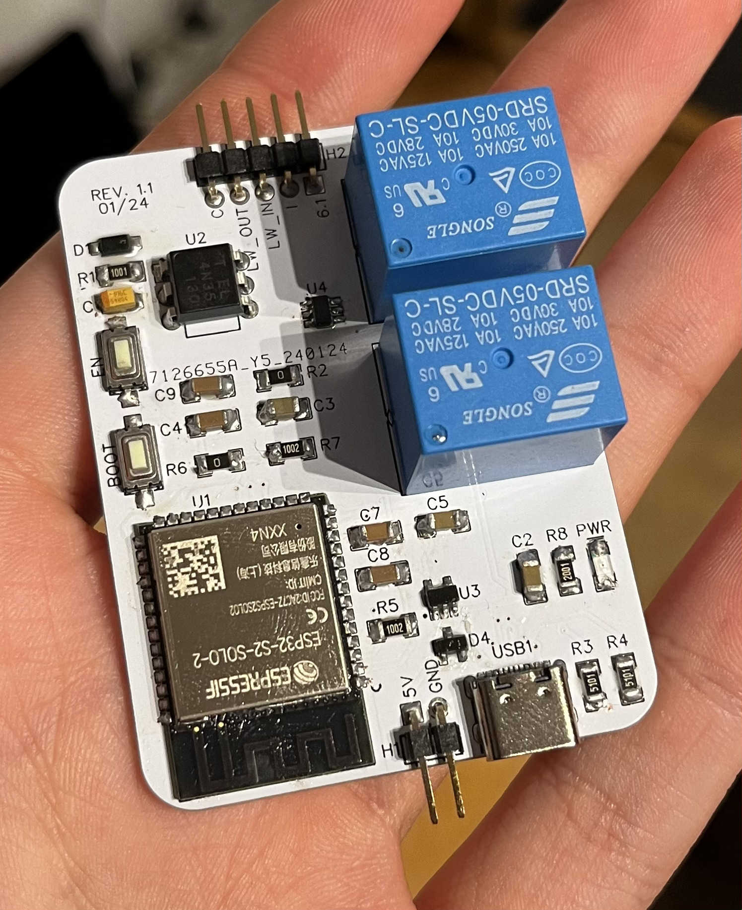

# EPS32 Smart Intercom Extension
ESP32 based pcb for controlling a Siedle HT611-01 Intercom

This is a project I did with the my fellow [T3chGuyz](https://github.com/T3chguys).
Its a pcb (printed circut board) that controls an existing intercom device installed in a multi family home. Similar to the [Nuki Opener](https://nuki.io/de/opener/). Can also be used for other devices meeting [some requirements](TODO).

# Features
- Open the main door
- A sensor for the doorbell
- Mute the doorbell
- Ring to open

# Getting Started

**Warning: I am by no means an expert. Do this at your own risk!**

If you want to use this project, you will need a few steps:

**Prequsitions:**
- Soldering equipment suitable for soldering smd components (iron, tin, flux, tweezers, etc.)
- Some jumper wires and clamps (depending on the device it will be installed in)
- Some $$$ (not much I promise)

**Ordering:**
In order to start building the pcb, you have to order all parts and the pcb itself.

Ordering the parts:
This is pretty easy. There is a BOM (bill of meterials) csv file for every revision in the github releases section. Just use your favorite supplier and import it.
I have used [LCSC](https://lcsc.com). Thus the BOM also contains a LSCS part number for every part.

Use the exact same parts, or similar ones if they are out of stock. Just make sure to use the **correct value and package**. For most smd parts its **1206** but make sure to match it in the BOM.
If you have found all parts then order online. For me this was around 5$ in 2024 (you may have to order more parts then needed depending on the supplier).

Ordering the pcb:
This is a little more tricky.
- From the same github release download the **Gerber File zip archive**.
- Import it at your favorite pcb manufacturer. I used [JLCPCB](https://jlcpcb.com).
- Change the color to your desire but keep most settings default. Make sure to Order just the pcb (if you dont want to let it be assembled)
- Place your order and thats it. You may have to order more than 1 pcb, depending on your manufacturer. This was around 2$ for me in 2024.

Now you wait for all the parts to arrive. The right time to buy some flux. (Trust me you will need it :))

**Assembling**
Once all your parts have arrived you can start to assemble your device.

This is pretty straigt forward. If you have never soldered smd components, I recommend you watch a tutorial first. You you are german I can recommend [this one](https://www.youtube.com/watch?v=4GrQNH80oDY)

Make sure to use the correct parts based on their qualifier. Use the [pcb layout picture](pcb/rev_1.1/pcb_layout_1.1.png) for help

**Function Testing**
Of courese use a multimeter to test if all connections are made as in the layout.

Additionally, test the USB connection. This is pretty hard to get right at the first attempt.
What I did:

- plug in a USB-A to USB-C cable
- use a multimeter to test connection from the exposed data and power pins in the USB-A port
- Make sure D+ and D- are *NOT* connected
- Make sure USB power is connected to D4

- Once thats good, plug in power and see if D4 outputs around 5V and U3 outputs around 3.3V
- If thats done youre ready to go

**Installing the firmware**
I used [ESPHome](https://esphome.io/) to flash this device.
The yaml config can be found in this repo too.

To get started with EPSHome see their website.

Make sure to adapt your WiFi credentials and add a esphome api key. I recommend to setup a new device in ESPHome and then copy the yaml contents in there.

The pins should match, but you can double check with the [schematic](pcb/rev_1.1/pcb_schematic_1.1.pdf).

# Installation

For installation in a Siedle HT611-01 just connect the labeld pins to the same labels on the PCB.

1. Remove the cable that connects LW on the intercom to the bell
2. Use a clamp and connect it to the LW_IN on this device
3. Connect LW_OUT on this device to the plus on the doorbell
4. Connect C on this device to the bell minus
5. Keep the connection from bell minus to the intercom
6. Connect 6.1 on this device to 6.1 on the intercom
7. Connect I on this device to I on on the intercom
8. Connect 5V to a power supply
9. Connect GND to a ground

Alternatively you may run it via USB-C

Explaination
- 6.1 - Door Opener plus
- I - Door Opener minus
- LW_IN - "Leutwerk" in
- LW_OUT - "Leutwerk" out
- C - "Leutwerk" minus
- 5V - connect some 5V power supply. Can be a cut up usb cable
- GND - connect ground

- **DON'T** connect 5V and usb at the same tme. D4 is a safety machanism for that but I cannot garantuee anything.

# How it Works
The functionality is pretty simple. Mostly relais.

- Opening the door is handled by the first relay, that will just simulate that the button is pressed. Pretty simple
- Muting the doorbell is also just a relay, but connected to NC. So your doorbell will ring if the device is turned off
- The doorbell sensor uses an [optocouppler](https://en.wikipedia.org/wiki/Opto-isolator) to get a notice of the AC signal from the intercom
- The rest is standard stuff for a esp32. The boot and en button, voltage regulation, etc. is pretty similar to a ESP32 dev board

Everything connected to the intercom is a separate circut, meaning no direct connection from the ESP32 to the intercom itself.

# Hardware requirements

If you want to install this in another intercom, make sure to meet these requirements:

- door opener circut co connect to
- Ring circut to connect to
- MAX 2A on the Ring circut (requirement by trace width)
- MAX voltage for opening and bell muting is 250V since I used overdimensionized relays. May change in a later revision.
- The circut for reading the bell signal is made to read a 12V AC signal. May work with DC, havn't tested
